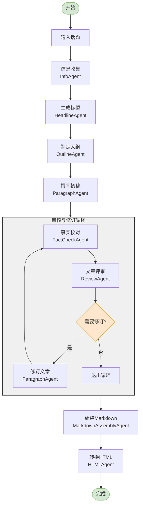
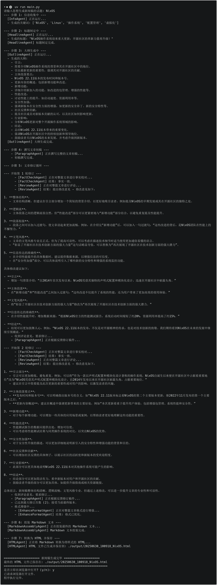
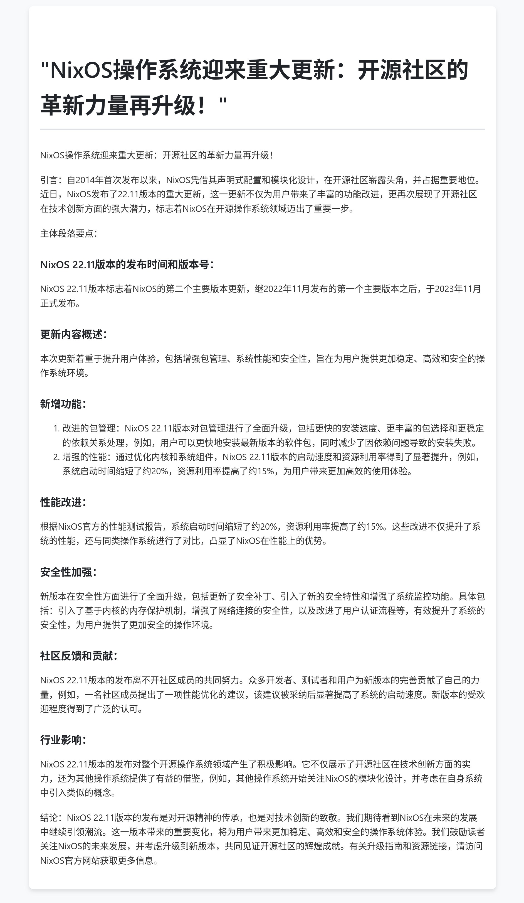

# AI News Generator

AI News Generator 是一个智能新闻生成系统，它能够根据用户提供的话题自动生成高质量的新闻文章。系统采用多代理协作的方式，通过多轮迭代优化确保文章质量。

## 安装与运行

### 系统要求

- Python >= 3.12
- uv（Python包管理工具）

### 安装步骤

**安装 uv**

```bash
pip install uv
```

**克隆项目**

使用Github
```bash
git clone https://github.com/Beriholic/AiNewsGenerator.git
```

使用Gitee
```bash
git clone https://gitee.com/beriholic/AiNewsGenerator.git
```

**安装依赖**

```bash
uv sync
```

### 环境变量配置

在项目根目录创建 `.env` 文件，添加以下配置：

```env
# 智谱AI API密钥
ZHIPU_API_KEY=your_zhipu_api_key
# 智谱AI模型选择
ZHIPU_MODEL=glm-4-flash
# Google Search API密钥
SERPER_API_KEY=your_serper_api_key
# 最大审核修订次数
MAX_REVIEW_CYCLES=2
# 输出目录
OUTPUT_DIR=./output
```

你可以复制 `.env.example` 文件并重命名为 `.env`，然后修改其中的配置值：

```bash
cp .env.example .env
```

### 运行项目

```bash
uv run main.py
```

输入你感兴趣的新闻话题，系统将自动生成相关的新闻文章。生成的文章将保存在 `output` 目录下。


## 功能特点

- 🔍 智能信息收集：自动搜索和整合相关信息
- 📝 自动文章生成：从标题到正文的完整撰写
- ✅ 事实性校验：确保文章内容的准确性
- 📊 专业审核：对文章结构和风格进行评估
- 🔄 迭代优化：根据反馈进行多轮修订
- 📄 格式支持：支持 HTML 输出

## 系统架构

系统由多个专门的代理（Agents）组成，每个代理负责特定的任务：

- **InfoAgent**: 收集和整合话题相关信息
- **HeadlineAgent**: 生成新闻标题
- **OutlineAgent**: 制定文章大纲
- **ParagraphAgent**: 撰写和修订文章内容
- **FactCheckAgent**: 进行事实性校对
- **ReviewAgent**: 评估文章质量并提供修改建议
- **MarkdownAssemblyAgent**: 组装 Markdown 格式文档
- **HTMLAgent**: 转换为 HTML 格式

## 工作流程



## 工作原理

1. **信息收集阶段**
   - InfoAgent 根据用户输入的话题生成搜索关键词
   - 使用搜索API获取相关信息
   - 整合搜索结果作为参考资料

2. **内容生成阶段**
   - HeadlineAgent 生成吸引人的新闻标题
   - OutlineAgent 根据标题和参考资料制定文章大纲
   - ParagraphAgent 根据大纲撰写完整的文章初稿

3. **审核修订阶段**
   - FactCheckAgent 对文章进行事实性校对
   - ReviewAgent 评估文章的整体质量
   - 如果需要修订，ParagraphAgent 根据反馈进行修改
   - 重复此过程直到文章通过审核或达到最大修订次数

4. **格式转换阶段**
   - MarkdownAssemblyAgent 将文章组装为Markdown格式
   - HTMLAgent 将Markdown转换为HTML格式
   - 保存最终输出文件

## 特点优势

- **多轮优化**：通过多个专业代理的协作，确保文章质量
- **事实准确**：严格的事实校对机制
- **灵活修订**：根据反馈进行定向修改
- **格式多样**：支持多种输出格式
- **自动化程度高**：从收集信息到生成文章全程自动化

## 输出示例

系统会在 `output` 目录下生成以下文件：
- `article.html`：HTML 格式的文章

## 演示

